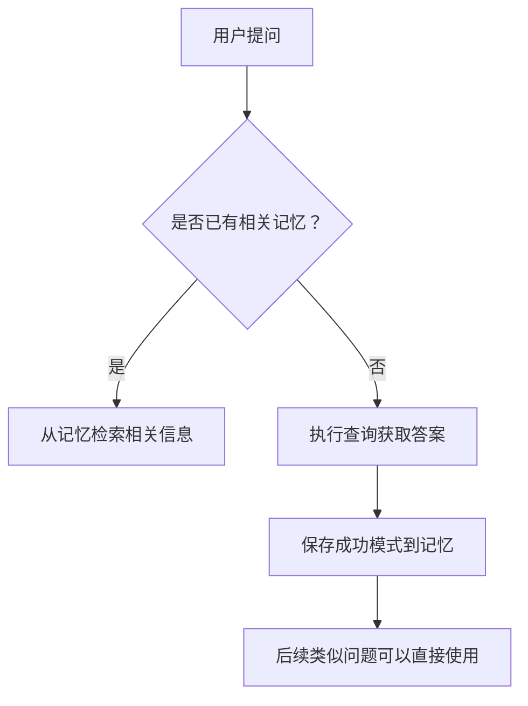

# Vanna 数据库信息处理机制

## 概述

本文档详细说明了Vanna如何向大语言模型（LLM）提供数据库信息，以及在面对大量表的大型数据库时的处理策略。通过分析代码实现，我们发现Vanna采用了基于记忆和上下文增强的方法，而不是直接将完整的数据库模式发送给LLM。

## 初始数据库信息获取

### 1. 训练计划生成

当Vanna首次连接到数据库时，它会通过`get_training_plan_generic`或数据库特定的`get_training_plan_*`方法来获取数据库的schema信息。这些方法在`vanna.base.VannaBase`类中定义：

#### 训练计划生成机制

```python
    def get_training_plan_generic(self, df) -> TrainingPlan:
        """
        This method is used to generate a training plan from an information schema dataframe.
        Basically what it does is breaks up INFORMATION_SCHEMA.COLUMNS into groups of table/column
        descriptions that can be used to pass to the LLM.
        """
        # For each of the following, we look at the df columns to see if there's a match:
        database_column = df.columns[
            df.columns.str.lower().str.contains("database")
            | df.columns.str.lower().str.contains("table_catalog")
        ].to_list()[0]
        schema_column = df.columns[
            df.columns.str.lower().str.contains("table_schema")
        ].to_list()[0]
        table_column = df.columns[
            df.columns.str.lower().str.contains("table_name")
        ].to_list()[0]
        columns = [database_column, schema_column, table_column]
        candidates = ["column_name", "data_type", "comment"]
        matches = df.columns.str.lower().str.contains("|".join(candidates), regex=True)
        columns += df.columns[matches].to_list()

        plan = TrainingPlan([])

        for database in df[database_column].unique().tolist():
            for schema in (
                df.query(f'{database_column} == "{database}"')[schema_column]
                .unique()
                .tolist()
            ):
                for table in (
                    df.query(
                        f'{database_column} == "{database}" and {schema_column} == "{schema}"'
                    )[table_column]
                    .unique()
                    .tolist()
                ):
                    df_columns_filtered_to_table = df.query(
                        f'{database_column} == "{database}" and {schema_column} == "{schema}" and {table_column} == "{table}"'
                    )
                    doc = f"The following columns are in the {table} table in the {database} database:\n\n"
                    doc += df_columns_filtered_to_table[columns].to_markdown()

                    plan._plan.append(
                        TrainingPlanItem(
                            item_type=TrainingPlanItem.ITEM_TYPE_IS,
                            item_group=f"{database}.{schema}",
                            item_name=table,
                            item_value=doc,
                        )
                    )

        return plan
```

#### 详细工作流程说明

1. **分析INFORMATION_SCHEMA数据**：
   - 方法接收一个包含数据库元数据的DataFrame
   - 这个DataFrame通常是从数据库的INFORMATION_SCHEMA.COLUMNS表查询获得
   - 包含所有表、列、数据类型、约束和注释的详细信息

2. **识别关键列**：
   - 动态识别不同数据库系统中的关键元数据列名
   - 支持多种命名方式（如"database"/"table_catalog"）
   - 自动适配不同数据库系统的元数据架构

3. **结构化信息**：
   - 遍历每个数据库-模式-表的组合
   - 将每个表的所有列信息（列名、数据类型、注释等）提取出来
   - 组织成Markdown格式的文档，便于LLM理解和学习

4. **创建训练计划**：
   - 为每个表创建一个TrainingPlanItem
   - item_type设置为ITEM_TYPE_IS（Information Schema）
   - item_group记录数据库和模式信息
   - item_name是表名
   - item_value包含详细的列信息文档

5. **训练计划的作用**：
   - 提供了一种结构化的方式来组织数据库schema知识
   - 允许用户选择性地导入部分schema信息
   - 为后续的增量学习提供了基础框架

### 2. 训练数据导入

获取到schema信息后，用户需要调用`vn.train()`方法将这些信息导入到Vanna的记忆系统中：

#### 训练数据导入机制

```python
    def train(
        self,
        question: str = None,
        sql: str = None,
        ddl: str = None,
        documentation: str = None,
        plan: TrainingPlan = None,
    ) -> str:
        """
        Train Vanna.AI on various types of data including SQL queries, DDL statements,
        documentation, and training plans.
        """

        if question and not sql:
            raise ValidationError("Please also provide a SQL query")

        if documentation:
            print("Adding documentation....")
            return self.add_documentation(documentation)


        if sql:
            if question is None:
                question = self.generate_question(sql)
                print("Question generated with sql:", question, "\nAdding SQL...")
            return self.add_question_sql(question=question, sql=sql)

        if ddl:
            print("Adding ddl:", ddl)
            return self.add_ddl(ddl)

        if plan:
            for item in plan._plan:
                if item.item_type == TrainingPlanItem.ITEM_TYPE_DDL:
                    self.add_ddl(item.item_value)
                elif item.item_type == TrainingPlanItem.ITEM_TYPE_IS:
                    self.add_documentation(item.item_value)
                elif item.item_type == TrainingPlanItem.ITEM_TYPE_SQL:
                    self.add_question_sql(question=item.item_name, sql=item.item_value)
```

#### 详细导入流程说明

`train()`方法是一个多用途函数，用于导入不同类型的数据到Vanna的记忆系统中：

1. **SQL查询对导入**：
   - 当用户提供问题和对应的SQL查询时
   - 系统会调用`add_question_sql()`方法
   - 如果没有提供问题，系统会自动生成一个问题
   - 生成的问题存储在记忆系统中，作为未来类似问题的参考

2. **DDL语句导入**：
   - 直接导入CREATE TABLE等DDL语句
   - 调用`add_ddl()`方法将DDL语句存储到记忆系统
   - 适用于已有建表脚本的情况

3. **文档导入**：
   - 导入业务规则、公司术语等文档
   - 调用`add_documentation()`方法进行存储
   - 增强LLM对业务领域的理解

4. **训练计划导入**：
   - 当传入一个TrainingPlan对象时
   - 系统遍历计划中的每个项目
   - 根据项目类型分别调用相应的添加方法
   - 这是导入从INFORMATION_SCHEMA生成的schema信息的主要方式

## 上下文增强机制

当LLM需要回答问题时，Vanna使用其上下文增强系统来提供相关的schema信息：

### 1. 系统提示词构建器（System Prompt Builder）


`DefaultSystemPromptBuilder` 负责生成LLM的系统提示词。它主要提供以下信息：

- 基本角色定义和响应指南
- 可用工具列表
- 内存工作流指令（如果相关工具可用）
- 文本内存使用示例（如数据库列含义、公司术语等）

### 2. LLM上下文增强器（LLM Context Enhancer）


`DefaultLlmContextEnhancer` 是处理上下文增强的核心组件。其工作机制如下：

```python
async def enhance_system_prompt(
    self, system_prompt: str, user_message: str, user: "User"
) -> str:
    # ... 其他逻辑 ...

    # 根据用户消息搜索相关的文本内存
    memories = await self.agent_memory.search_text_memories(
        query=user_message, context=context, limit=5
    )

    if not memories:
        return system_prompt

    # 将找到的相关记忆作为上下文片段添加到系统提示词中
    examples_section = "\n\n## Relevant Context from Memory\n\n"
    examples_section += "The following domain knowledge and context from prior interactions may be relevant:\n\n"

    for result in memories:
        memory = result.memory
        examples_section += f"• {memory.content}\n"

    return system_prompt + examples_section
```

该增强器的主要特点：
- 根据用户的初始消息查询AgentMemory
- 向系统提示词添加最多5个最相关的文本内存项
- 这些内存可能包含重要的数据库相关信息（列含义、数据类型、关系等）

### 3. 记忆系统（Memory System）


Vanna的智能行为依赖于其记忆系统，该系统由两个主要部分组成：

#### 工具使用记忆 (Tool Usage Memory)
- 存储成功的“问题-工具-参数”组合
- 在执行任何工具前必须调用 `search_saved_correct_tool_uses`
- 成功执行后必须调用 `save_question_tool_args` 来保存模式

#### 文本记忆 (Text Memory)
- 用于存储自由格式的重要见解或上下文
- 使用 `save_text_memory` 保存重要信息
- 特别适用于记录：
  - 数据库模式细节（列含义、数据类型、关系）
  - 公司特定术语和定义
  - 查询模式或数据库最佳实践
  - 业务或数据领域的专业知识
  - 用户对查询或可视化的偏好

## 大型数据库处理策略

当面对拥有大量表的大型数据库时，Vanna采用以下策略来避免将过多的信息一次性提供给LLM：

### 1. 上下文相关性过滤

#### 上下文相关性过滤机制详解

Vanna不会将所有数据库信息发送给LLM，而是仅根据用户的具体问题动态提取相关的信息。这种方法的核心是基于相似性搜索的上下文相关性过滤：

1. **查询向量化**：
   - 当用户提出问题时，系统首先将问题转换为向量表示
   - 使用嵌入模型将自然语言查询编码为高维向量

2. **相似性搜索**：
   - 在记忆系统中搜索与问题向量最相似的已知模式
   - 使用余弦相似度或其他相似性度量算法
   - 返回top-k（通常是5个）最相关的记忆项

3. **动态上下文注入**：
   - 将最相关的schema信息片段添加到系统提示词中
   - 只传递与当前查询高度相关的上下文信息
   - 避免信息过载和token浪费

4. **过滤优势**：
   - **降低token消耗**：只发送与当前查询相关的必要信息
   - **提高准确性**：减少信息过载，让LLM专注于相关上下文
   - **提升性能**：更快的响应时间和更低的成本
   - **更好的可扩展性**：能够处理包含数百甚至数千张表的大型数据库

这种机制特别适用于大型数据库场景，因为它允许Vanna随着数据库规模的增长而线性扩展，而不是指数级增加复杂性。

### 2. 渐进式知识积累

Vanna通过会话中的持续交互逐步建立对数据库的理解：



这种渐进式学习方法确保了：
- 常见问题的回答速度越来越快
- 准确的模式会被重复利用
- 错误的模式可以被覆盖更新

### 3. 分步推理流程

对于复杂问题，Vanna采用分步工具循环处理：
1. **分析阶段**：理解用户意图并确定需要访问哪些表
2. **检索阶段**：使用适当的工具（如run_sql）获取所需数据
3. **验证阶段**：检查结果并决定是否需要进一步操作
4. **总结阶段**：提供最终回答

这个过程由LLM驱动，通过多次迭代完成复杂的分析任务。

## 实现细节

### 1. 工具注册机制

Vanna通过 `ToolRegistry` 安全可靠地与外部系统（如数据库、文件系统）交互。关键特性包括：

- **安全性**：通过在工具中注入依赖项（如SqlRunner）实施细粒度权限控制
- **可扩展性**：通过创建新工具类轻松集成新功能
- **解耦**：LLM只需了解工具名称和参数，具体实现隐藏在工具类中

### 2. 内存存储

`AgentMemory` 接口允许不同的实现方式（本地向量DB、远程云服务等），支持：
- 相似性搜索以查找相关的过往互动
- 结构化存储用于高效检索
- 長期知识沉淀

## 设计优势

Vanna的数据库信息处理架构具有以下几个显著优点：

- **可扩展性**：通过工具注册机制轻松添加新的记忆类型
- **上下文感知**：提示词内容根据用户权限和可用工具动态调整
- **知识沉淀**：通过记忆系统实现组织知识的积累和传承
- **持续优化**：随着时间推移，Vanna能够更快地回答常见问题
- **安全性**：严格的权限控制确保用户只能访问授权的工具和数据
- **灵活性**：通过增强器和丰富器模式，可以灵活注入各种上下文信息而不修改核心逻辑

## 总结

Vanna并没有简单地将整个数据库schema传递给LLM，而是设计了一个更为智能和高效的系统。通过结合记忆系统、上下文增强和分步推理，它能够在不过载LLM的情况下处理复杂的数据库分析任务。

当面对大型数据库时，这种基于相关性的动态信息提取方法特别有效。它不仅减少了token使用和成本，还提高了回答的质量和准确性。随着更多交互的发生，Vanna的知识库不断增长，使其成为一个真正能学习和适应的企业级智能数据分析平台。