问题背景
[]
https://vanna.ai/diagrams/problem-solution.svg
## 1、交互展示

## 2、信息存储机制




1）文本信息的存储
Agent会判断当前的历史对话中是否有关键信息需要存储，当有需要时调用save_text_memory工具：
```
**Content:** Chiwen平台的运行记录存储在以T_Run开头的表中：T_RunProcessRecord和T_RunRecord。这些表可能包含系统中流程和运行的执行数据。 **Timestamp:** 2025-12-03T14:21:58.273841 **ID:** `ba94467c-37f7-46e6-bd47-a78627217a1d`
```
```
**Content:** 数据库“runcontroller”包含与审计日志（AbpAuditLogs、AbpAuditLogActions）、实体变更（AbpEntityChanges、AbpEntityPropertyChanges）、Quartz调度器（QRTZ_%表）、错误处理记录（T_Error%Record）、流程执行记录（T_Run%、T_ProcessCommandRecord）以及甘特图数据（T_GanttDataRecord）相关的表。 **Timestamp:** 2025-12-03T14:21:26.290732 **ID:** `cb281337-f2fc-47d7-8bf7-8489df2e3d8d`
```
2）问题-SQL
Agent会根据工具是否执行成功及有效性来判断是否调用save_tool存储对应的问题对：
```
帮我查找销售最好的商品
   Args: {'sql': 'SELECT product_name, SUM(quantity * price) as total_sales FROM sales GROUP BY product_name ORDER BY total_sales DESC LIMIT 10'}
```

3）SQL查询的数据
查询返回的数据采用 Dual output 分两份输出：详细的数据保存到csv文件，给大模型的内容是数据摘要和数据文件名称，当需要可视化数据时从文件中读取数据：
```txt
name
customers
sqlite_sequence
sales
orders

Results saved to file: query_results_08ea6061.csv

**IMPORTANT: FOR VISUALIZE_DATA USE FILENAME: query_results_08ea6061.csv**
```

## 3、信息调取机制
1）文本信息调取
这些信息会加入到系统提示词中——根据对话动态生成系统提示词：

```txt
You are Vanna, an AI data analyst assistant created to help users with data analysis tasks. Today's date is 2025-12-03.
Response Guidelines:
- Any summary of what you did or observations should be the final step.
- Use the available tools to help the user accomplish their goals.
- When you execute a query, that raw result is shown to the user outside of your response so YOU DO NOT need to include it in your response. Focus on summarizing and interpreting the results.

You have access to the following tools: run_sql, save_question_tool_args, search_saved_correct_tool_uses, save_text_memory, visualize_data

============================================================
MEMORY SYSTEM:
============================================================

1. TOOL USAGE MEMORY (Structured Workflow):
--------------------------------------------------
• BEFORE executing any tool (run_sql, visualize_data, or calculator), you MUST first call search_saved_correct_tool_uses with the user's question to check if there are existing successful patterns for similar questions.
• Review the search results (if any) to inform your approach before proceeding with other tool calls.
• AFTER successfully executing a tool that produces correct and useful results, you MUST call save_question_tool_args to save the successful pattern for future use.
Example workflow:
  • User asks a question
  • First: Call search_saved_correct_tool_uses(question="user's question")
  • Then: Execute the appropriate tool(s) based on search results and the question
  • Finally: If successful, call save_question_tool_args(question="user's question", tool_name="tool_used", args={the args you used})
Do NOT skip the search step, even if you think you know how to answer. Do NOT forget to save successful executions.
The only exceptions to searching first are:
  • When the user is explicitly asking about the tools themselves (like "list the tools")
  • When the user is testing or asking you to demonstrate the save/search functionality itself
2. TEXT MEMORY (Domain Knowledge & Context):
--------------------------------------------------
• save_text_memory: Save important context about the database, schema, or domain
Use text memory to save:
  • Database schema details (column meanings, data types, relationships)
  • Company-specific terminology and definitions
  • Query patterns or best practices for this database
  • Domain knowledge about the business or data
  • User preferences for queries or visualizations
DO NOT save:
  • Information already captured in tool usage memory
  • One-time query results or temporary observations
Examples:
  • save_text_memory(content="The status column uses 1 for active, 0 for inactive")
  • save_text_memory(content="MRR means Monthly Recurring Revenue in our schema")
  • save_text_memory(content="Always exclude test accounts where email contains 'test'")

## Relevant Context from Memory

The following domain knowledge and context from prior interactions may be relevant:

• 合同管理系统：T_Contract（合同信息），T_ContractClause（合同条款），T_ContractExecution（合同履行），T_ContractRenewal（合同续约）。
• 客户关系管理（CRM）模块包括：T_Customer（客户信息），T_CustomerInteraction（客户互动记录），T_CustomerContract（客户合同），T_CustomerFeedback（客户反馈）。
• 物流配送系统表：T_Shipment（发货单），T_ShipmentTracking（配送追踪），T_DeliveryAddress（送货地址），T_LogisticsProvider（物流商）。
• 销售数据分析表包括：T_Sales（销售记录），T_SalesTarget（销售目标），T_SalesPerformance（销售业绩），T_SalesRegion（销售地区）。
• 知识库文档管理：T_Document（文档），T_DocumentCategory（文档分类），T_DocumentVersion（文档版本），T_DocumentAccess（文档访问权限）。
```

2）问题-SQL信息的调取
轻量级的相似性搜索方式：
Jaccard + difflib

当匹配到记录后，将记录作为工具调用结果：
```txt
Found 1 similar tool usage pattern(s):

1. run_sql (similarity: 0.83)
   Question: 帮我查找销售最好的商品
   Args: {'sql': 'SELECT product_name, SUM(quantity * price) as total_sales FROM sales GROUP BY product_name ORDER BY total_sales DESC LIMIT 10'}
```

## 4、权限隔离
1）工具的调用可以设置权限
并不是所有的用户都可以增删知识库信息
只有管理员可以，因此管理员可以对知识库进行管理，删除不必要的知识，剩下的知识作为有效的信息。

## 5、查询结果的图表是如何绘制的？
先通过ploty库转为json格式，再传递给前端进行绘制

## 和sanic-web的对比

1、信息的沉淀
1）sanic-web将表的schema作为知识库，这些信息是静态的，在交互过程中，sanic-web可能会发现表中的重要信息或表之间的关联，但这些关键信息并不会被沉淀，仅在当前对话中存在
2）vanna将信息分为两类，一类是它探索到的关键信息，这类信息会动态加载到系统提示词中，为当前对话提供有效线索；另一类信息是和用户问题相关的成功执行的工具调用，它能作为一种辅助信息帮助模型更好的知道当前问题该调用哪些工具，以及这些工具的正确参数传递方式；
vanna会将和用户交互中产生的信息沉淀下来，当然这些信息的有效性取决于大模型本身的能力，大模型记录的信息并不一定是有效的，但vanna中这些信息是可管理的，管理员可以删除无效的信息以构建高质量的信息库。

2、信息探索的自由度
1）sanic-web是一个固定的流程：查schema-> 生成sql -> 执行sql -> 绘制图表 -> 总结，自由度有限，因此更加可控。
2）vanna采用React Agent方式，能灵活的调用提供的工具，因此能更自由的探索数据库中的信息，以及库表之间的关联。

3、数据展示方面
1）sanic-web将可视化工具封装为mcp服务进行调用，由大模型决定展示方式，在实践中展示效果更美观；
2）vanna根据数据形式决定展示方式，不一定能以最佳的效果展示；

4、权限控制方面
1）sanic-web中没有权限管理和数据库用户的权限直接关联
2）①vanna中可以设置用户组，工具的调用权限和用户所在组关联，比如search_saved_correct_tool_uses可以设置为管理员权限组，普通用户没有调用权；②vanna中提供钩子方法修改工具的调用参数以增强工具的权限管理，例如SQL语句中限定部门：

```sql
if "admin" in user.group_memberships:  
    return args  # 管理员看到所有数据  
elif "analyst" in user.group_memberships:  
    modified_message = args.message + " WHERE department='analytics'"  
    return SimpleToolArgs(message=modified_message)  
else:  
    modified_message = args.message + f" WHERE user_id='{user.id}'"  
    return SimpleToolArgs(message=modified_message)
```


